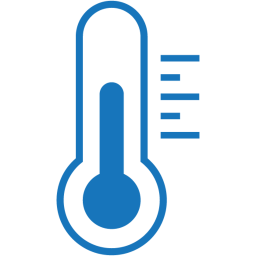

#  Syno CPU Temperature

<!---  --->

### Description

Synology package to log CPU temperature to help troubleshooting Synology randomly shutting down due to overheating.

Available for DSM 7 and DSM 6.

### How to install the package

There are 2 ways to install the package:

**Directly from Package Center**

1. Add [007revad Synology Package Source](https://github.com/007revad/Synology_package_source) to package Center.
2. Click on the Community section in Package Center and install the package.

<kbd></kbd>

**Or download the package and install it manually**
1. Download the latest version .spk file from https://github.com/007revad/Syno_CPU_Temperature/releases and save it to your Synology.
2. In Package Center click on Manual Install.
3. Browse to where you downloaded the .spk file.
4. Select the .spk file and click Next.

### Screenshots

<!--- 
Description of image 1 goes here
 --->

<kbd></kbd>

 

Settings window

<kbd></kbd>

 

AMD CPUs

<kbd></kbd>

<!--- 
Description of image 2 goes here
 --->

<kbd></kbd>

 

Intel 4 core CPU

<kbd></kbd>

 

Realtek ARM CPU

<kbd></kbd>

 

DSM 6 Intel 2 core CPU

<kbd></kbd>

 

Select text and right-click to copy log

<kbd></kbd>

